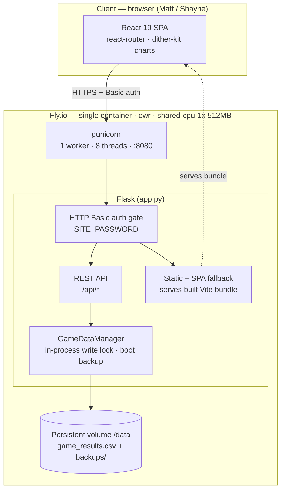
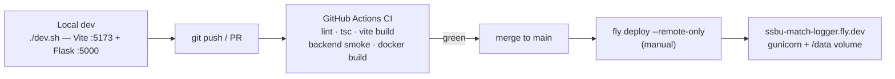

# Smash Bros Match Logger

A full-stack web app for tracking Super Smash Bros Ultimate matches between two
players (Shayne vs Matt). A Flask API and a React (Vite) single-page app ship as
one container, backed by CSV storage with session grouping and rich analytics.
Roughly 3,200 historical matches are already logged.

**Stack:** React 19 · react-router 6 · Vite 6 · TypeScript 5.8 ·
[dither-kit](https://www.tripwire.sh/dither-kit) charts (vendored, MIT) ·
Space Grotesk / IBM Plex Mono type system · Flask 3.1 · gunicorn · pandas / numpy ·
deployed on Fly.io.

## System design

One container runs everything: gunicorn fronts the Flask app, which serves both
the built React bundle (with SPA fallback) and the REST API, and reads/writes a
single CSV on a persistent volume. The whole app sits behind HTTP Basic auth
until real multi-user auth ships.



Build and release pipeline — CI is a gate only; deploys are manual, mirroring
the nesty deployment pattern:



## Features

- **Session command center** (homepage): a live scoreboard for the current
  session. On desktop, a sidebar-framed dashboard — cinematic VS scoreboard,
  on-deck matchup history (all-time / last-50 / this-session), session-scoped
  tiles, the match feed, stages-this-session, and a docked log rail. On mobile,
  a tabbed phone app (Session / Log / Stats / History) with three switchable
  hero directions (Scoreboard · Momentum sparkline · Tale of the tape). Global
  all-time stats live on the Stats tab, keeping the homepage session-scoped.
- **Match logging**: fighter pickers pre-filled from the on-deck matchup, sticky
  stage, winner + stocks, and a one-tap undo toast after each log
- **Match editor**: fix mislogged matches (characters, winner, stage, stocks) or
  delete bogus rows from the session feed's see-all/edit modals; every edit is
  recorded in an audit log (`edit_log.csv`)
- **Session tracking**: games auto-group into sessions (a 4+ hour gap starts a
  new one)
- **Statistics dashboard**: win rates, streaks, monthly activity, top matchups,
  head-to-head breakdown, advanced metrics, matchup matrix
- **Per-player stats**: win-rate timelines, day/hour performance heatmaps,
  character and stage stats, tearsheets
- **Character analytics**: per-character win rates, matchup performance, stage
  performance, and a usage overview / tier list
- **Session history**: browse sessions, session detail views, session comparison
- **Local CSV storage**: timestamped entries with an automatic backup on each boot
- **Dark UI**: Gruvbox palette, elevated with a Space Grotesk / IBM Plex Mono type
  system; responsive shell (desktop sidebar / mobile bottom-tabs + drawer)

## Live deployment (Fly.io)

Production is a single Fly.io app in `ewr` serving the API and the built frontend
from one container, gated by HTTP Basic auth via the `SITE_PASSWORD` secret. Match
data lives on a persistent volume (`DATA_DIR=/data`), never in the image, with
14-day volume snapshots plus a boot-time CSV backup.

- **URL**: `https://ssbu-match-logger.fly.dev` (enter any username + the shared password)
- **Deploy**: `fly deploy --remote-only --ha=false`
- **Full runbook** (first deploy, seeding data, rollback, backups): [docs/DEPLOY.md](docs/DEPLOY.md)
- **Roadmap** (public-launch plan, data-layer migration): [docs/ROADMAP.md](docs/ROADMAP.md)

Scale-to-zero is on (`min_machines_running = 0`): the machine sleeps when idle and
cold-starts in a few seconds on the first request — right for a bursty session logger.

## Local setup

1. Clone the repository:

   ```bash
   git clone https://github.com/0xHarrington/ssbu-match-logging.git
   cd ssbu-match-logging
   ```

2. Set up the backend:

   ```bash
   python3 -m venv backend/venv
   source backend/venv/bin/activate  # Windows: backend\venv\Scripts\activate
   pip install -r backend/requirements.txt
   ```

3. Set up the frontend:

   ```bash
   cd frontend && npm install && cd ..
   ```

4. Run both servers (requires `nvm` for Node):

   ```bash
   ./dev.sh
   ```

   - Backend: http://127.0.0.1:5000
   - Frontend: http://localhost:5173

   Or run them separately — **backend must run from `backend/`** so CSV and config
   paths resolve:

   ```bash
   source backend/venv/bin/activate
   cd backend && python3 app.py     # terminal 1
   cd frontend && npm run dev        # terminal 2
   ```

## Project structure

```
backend/
  app.py                # Flask app: GameDataManager + all /api/* endpoints + SPA fallback
  characters.json       # character roster / metadata
  game_results.csv      # match store (dev; on the Fly volume in prod)
  .env.example          # SITE_PASSWORD, DATA_DIR, FLASK_DEBUG
frontend/src/
  App.tsx               # router (routes are code-split); wraps pages in AppShell
  session/              # Session command center: SessionPage + Desktop/Mobile
                        #   layouts, components/, mobile/, useLogForm, format
  hooks/                # useLiveSession (derives the live session), useMediaQuery
  lib/api.ts            # typed API client (new screens); lib/stages.ts stage map
  types.ts              # shared domain types for the redesign
  StatsPage / Session*  # dashboards, session views, tearsheets
  CharacterAnalytics/Detail.tsx
  components/shell/     # AppShell (sidebar / bottom-tabs + drawer), nav icons
  components/           # CharacterDisplay, PerformanceHeatmap, Feedback, dither/, stats/
docs/DEPLOY.md          # Fly.io runbook
docs/ROADMAP.md         # public-launch roadmap
Dockerfile              # 2-stage build: Vite bundle -> Python runtime
fly.toml                # Fly config (ewr, volume mount, scale-to-zero)
.github/workflows/ci.yml
```

## Data format

Match data is stored in `game_results.csv` (on `/data` in production) with columns:

| Column | Meaning |
|---|---|
| `datetime` | match timestamp |
| `shayne_character` / `matt_character` | characters used |
| `winner` | `Shayne` or `Matt` |
| `stocks_remaining` | winner's stocks left (optional) |
| `stage` | stage name (or `No Stage`) |
| `timestamp` | Unix timestamp |
| `session_id` | session identifier, derived from time gaps |

## Development notes

- `backend/venv` is gitignored; activate it before running or developing the backend.
- After adding Python deps: run `pip freeze > requirements.txt` from `backend/` and
  commit `backend/requirements.txt`.
- **Keep gunicorn at `--workers 1`**: the CSV write lock is in-process, so multiple
  workers would reintroduce lost-write races. Lift this only after the data layer
  moves to SQLite/Postgres (see [docs/ROADMAP.md](docs/ROADMAP.md)).
- CI gates every push/PR (frontend lint + `tsc` + `vite build`, backend compile +
  import smoke test, full Docker build). It never deploys — deploys stay manual.

## License

MIT License — use and modify as you like.
