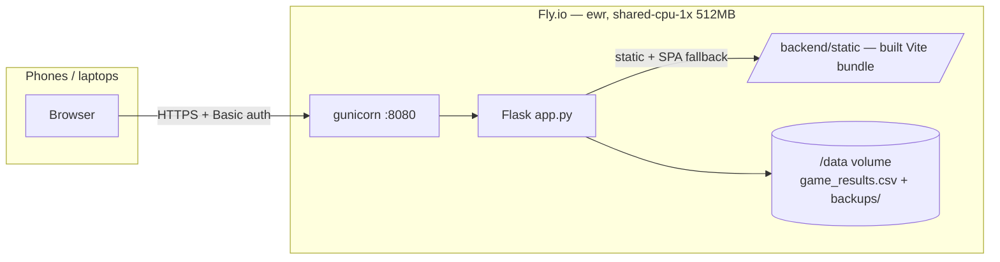

# Deployment Runbook — Fly.io

Single Fly.io app serving both the API and the built frontend from one container.
Pattern borrowed from nesty (`~/Dev/nesty`): one machine in `ewr`, data on a
persistent volume, secrets via `flyctl`, manual deploys, CI as a gate only.

## Architecture



- **One service, no CORS**: Flask serves `frontend/dist` (copied to `backend/static`
  in the Docker build) and falls back to `index.html` for client-side routes.
- **Auth**: the whole app sits behind HTTP Basic auth when the `SITE_PASSWORD`
  secret is set. This is the staging gate until real multi-user auth ships.
- **Data**: `DATA_DIR=/data` puts `game_results.csv` and `backups/` on the volume.
  The image never contains match data.
- **Vision (optional)**: auto-capture (`/capture`, plans/010) needs the
  `ANTHROPIC_API_KEY` secret. Without it the app runs normally and the vision
  endpoints return 503. `VISION_MAX_CALLS_PER_DAY` (default 1500) caps daily
  spend; keyframes + extraction provenance land in `/data/vision/`.

## First deploy

```bash
brew install flyctl && fly auth login          # once
cd ~/Dev/ssbu-match-logging

fly launch --no-deploy --copy-config           # accept app name from fly.toml
fly volumes create ssbu_data --region ewr --size 1
fly secrets set SITE_PASSWORD='<shared password for you + Shayne>'
fly secrets set ANTHROPIC_API_KEY='<key>'      # optional: enables /capture auto-logging
fly deploy --remote-only --ha=false
```

Seed the existing 3,197 matches (one-time). **Gotcha:** the app creates an
empty `game_results.csv` on first boot, and sftp `put` will NOT overwrite it —
it fails with `file exists on VM` (easy to miss; it looks like output, but the
upload did not happen). Remove the empty file first:

```bash
fly ssh console -C "rm /data/game_results.csv"
fly ssh sftp shell
# inside the sftp shell:
put backend/game_results.csv /data/game_results.csv
# Ctrl-D to exit

# verify the seed landed (expect 3198 = 3197 matches + header):
fly ssh console -C "wc -l /data/game_results.csv"
```

No restart needed (the CSV is read per request). Open
`https://ssbu-match-logger.fly.dev`, enter any username + the shared password,
and verify Recent Matches shows the historical data.

## Routine deploys

```bash
fly deploy --remote-only --ha=false
```

CI (`.github/workflows/ci.yml`) gates every push/PR: frontend lint + `tsc` +
`vite build`, backend compile + import smoke test, and a full Docker build.
It never deploys — deploys stay manual, same as nesty.

## Rollback / ops

| Task | Command |
|---|---|
| Tail logs | `fly logs` |
| List releases | `fly releases` |
| Roll back | `fly releases rollback <version>` |
| Shell into machine | `fly ssh console` |
| Pull data down | `fly ssh sftp get /data/game_results.csv` |

## One-time CSV rewrite on upgrade (match-editor release)

The first boot after deploying the match-editor release runs an idempotent
repair pass: it adds a `match_id` column and derives missing unix timestamps
from `datetime` strings (218 legacy rows). The whole CSV is rewritten once,
under the write lock, with the boot backup taken beforehand. Subsequent boots
are no-ops. Match edits/deletes are audited in `/data/edit_log.csv`.

## Backups

1. **Fly volume snapshots** — automatic, block-level, `snapshot_retention = 14` days (configured in fly.toml).
2. **App-level backups** — the app copies the CSV to `/data/backups/` on each boot (existing behavior, now volume-persisted).
3. **Off-site** — periodically `fly ssh sftp get /data/game_results.csv` to the laptop. Worth automating with a GitHub Actions cron + admin endpoint once usage resumes (see nesty's `vault-snapshot.yml` for the pattern).

## Scale-to-zero tradeoff

`min_machines_running = 0`: the machine stops when idle and cold-starts in a few
seconds on the first request. Right for a bursty session logger (near-$0 idle
cost). If the wake-up ever annoys during sessions, set it to 1 (~$3–4/mo).

## Local production smoke test

```bash
cd frontend && npm run build && cp -r dist ../backend/static && cd ..
cd backend && DATA_DIR=. FLASK_DEBUG=0 SITE_PASSWORD=test \
  arch -x86_64 venv/bin/gunicorn --workers 1 --threads 8 --bind 127.0.0.1:8090 app:app
```

Note: `arch -x86_64` is needed **only on this Mac** — the current `backend/venv`
holds x86_64 wheels (Rosetta). The Docker image is unaffected.

## Constraints to respect

- **Keep `--workers 1`** (set in the Dockerfile). The CSV write lock is
  in-process; multiple gunicorn workers would reintroduce lost-write races.
  Lift this only after the SQLite/Postgres migration (ROADMAP Phase 2).
- A second pair (e.g. Matt + Jaspreet) before multi-tenancy = a second Fly app
  with its own volume and password: `fly launch` with a different app name.
  Cheap, isolated, zero code changes (player display names are still
  Shayne/Matt in the UI until Phase 3 generalization).
