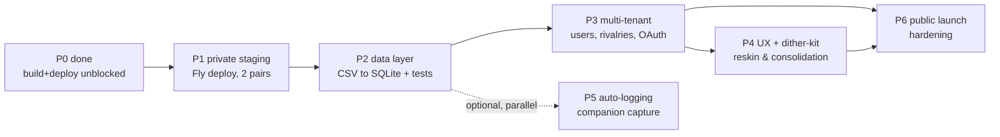
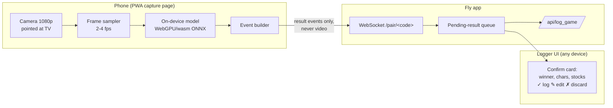

# Roadmap — Public Launch, UX Overhaul, and Auto-Logging

> Status: proposed, 2026-07-12. Supersedes the hosting section of `LAUNCH.md`
> (2026-04-30); the schema/auth design there still stands and is referenced below.

## 1. Where the repo stands (July 2026 survey)

3,197 matches logged through 2025-12-11. Flask (single-file `app.py`, pandas-on-CSV,
24 API routes) + React 19/Vite frontend (ECharts, Gruvbox theme). Mature analytics,
zero tests, two-player assumption baked into the CSV schema itself
(`shayne_character` / `matt_character` columns).

**Fixed in the 2026-07-12 session** (unblocking any deploy):

- `npm run build` failed on 11 TS errors → fixed; production builds pass.
- Character icons used dev-only `/src/assets/...` URLs → now bundled via
  `import.meta.glob` (`CharacterDisplay.tsx`), and `MatchLogger` uses the shared
  resolver (also fixes icons for `Mr. Game & Watch`-style names there).
- No auth, `debug=True`, no WSGI server, unlocked CSV writes → Basic-auth gate
  (`SITE_PASSWORD`), env-gated debug, gunicorn, in-process write lock, `DATA_DIR`.
- Yoshi's Story removed from the stage picker (kept in image maps so historical
  matches still render).
- Pipeline: `Dockerfile`, `fly.toml`, `.github/workflows/ci.yml`,
  `.env.example`, `docs/DEPLOY.md`.

**Also implemented 2026-07-12/13** (originally backlog items — see §4 for what remains):

- Logger ergonomics: sticky stage selection (localStorage, survives submits),
  10-second Undo window backed by `POST /api/undo_last_game` (write-locked,
  E2E-tested).
- Bundle diet: route-level code splitting (9 lazy chunks), ECharts dynamically
  imported from the eager homepage — entry chunk 1.9 MB → 280 kB (95 kB gzip).
- Chart consolidation: the lone Chart.js bar rebuilt in ECharts;
  `chart.js`, `react-chartjs-2`, `chartjs-plugin-datalabels`, `axios` removed.
- Every chart mount now has `ResizeObserver` → `resize()` + dispose cleanup.
- Shared `lib/stages.ts` stage map (was copy-pasted in 7 files) and
  `components/Feedback.tsx` (`LoadingState` / `ErrorState` with retry) adopted
  across the six stats/tearsheet pages.
- 404 route; dead plotly stub, stray root `package.json`, and empty backend
  scaffold dirs removed; `frontend/package-lock.json` now committed (CI/Docker
  need it).
- **Match editor** (2026-07-14): every match has a stable `match_id`
  (idempotent startup backfill, which also repaired 218 legacy rows missing
  timestamps); `GET /api/matches`, `PUT/DELETE /api/matches/<id>` with
  validation + `edit_log.csv` audit trail; edit modal reachable from Recent
  Matches and session detail. First backend pytest suite landed with it
  (seed of the P2 characterization harness). `match_id` becomes the primary
  key in the P2 SQLite migration.

**Known debt** (ranked, from the survey):

| # | Debt | Where |
|---|---|---|
| 1 | Two-player schema hardcoded (columns, `["Shayne","Matt"]` loops, ternary opponent derivation) | `app.py` throughout |
| 2 | CSV read-modify-write; GET endpoints rewrite the file (session-ID backfill) | `app.py` `get_sessions` |
| 3 | Zero tests; nothing guards a data-layer migration | — |
| 4 | ~700 hardcoded Gruvbox hex literals in TSX vs. the CSS-variable system that already exists | all pages |
| 5 | `stageImages` map + stage imports copy-pasted in 7 files; icon logic in 11; per-component `fetch` | frontend |
| 6 | 3 chart deps (echarts + chart.js for one chart + dead plotly stub); 1.9 MB JS bundle, no code splitting | `frontend/package.json` |
| 7 | Streak logic reimplemented 4× with drifting semantics; duplicated groupby blocks | `app.py` |
| 8 | Stray files: empty `instance/` SQLite, empty `models|routes|services|utils/` dirs, root `package.json`, `reid_family_feud_data.csv`, `spare data/`, one-shot scripts | repo root / backend |
| 9 | Inconsistent API envelopes (`{success,...}` vs bare objects); 2 routes lack error handling | `app.py` |
| 10 | Local venv is x86_64/Rosetta on an arm64 Mac (`arch -x86_64` needed) | `backend/venv` |

## 2. Hosting decision

**Recommendation: Fly.io, one app, one container.** Reasons, in order:

1. **Zero-CORS by construction** — Flask serves the built frontend; the
   LAUNCH.md Vercel+Railway split would need a CORS layer that doesn't exist today.
2. **Infrastructure consolidation** — nesty already runs on Fly (`ewr`); same
   CLI, same volume/backup/secret patterns, one dashboard, one bill (~$0–4/mo
   at this scale with scale-to-zero).
3. **The data model isn't settled** — a volume-backed file (CSV now, SQLite in
   Phase 2) keeps migration trivial. Committing to managed Postgres before
   multi-tenancy is premature.

Alternatives considered — revisit at the **Phase 3 gate** (real signups):

| Option | Verdict now | Reconsider when |
|---|---|---|
| Vercel + Railway + Supabase (LAUNCH.md Path A) | Three vendors, CORS work, but Supabase Auth+RLS+Postgres is genuinely strong for multi-tenant | Phase 3, if building OAuth by hand feels wrong |
| Render / Railway single container | Equivalent to Fly, no existing footprint | Only if Fly pricing/reliability degrades |
| Hetzner/VPS | Cheapest at sustained load; you run the ops | Never at this scale |
| Cloudflare Pages+Workers | Requires a Python→JS backend rewrite | Not for Flask |

## 3. Phases

### P1 — Private staging on Fly (~1 evening)
Deploy per `docs/DEPLOY.md`; seed the CSV; Matt+Shayne log from phones behind the
shared password. **Second pair now, zero code:** a second Fly app
(`ssbu-matt-jaspreet`) with its own volume + password. Pairs run in parallel,
fully isolated; the only wart is UI labels still read Shayne/Matt (cosmetic
env-var override is a 1-hour patch if it grates; `backend/spare data/jaspy.csv`
suggests this data already exists — seed it).

### P2 — Data layer: CSV → SQLite on the volume (~1 week of evenings)
- Characterization tests **first**: snapshot all 23 endpoint responses against
  the real CSV (pytest + Flask test client); these are the migration oracle
  (LAUNCH.md principle 4).
- SQLite (stdlib, single file on `/data`, WAL mode) — not Postgres yet: keeps
  one service, keeps Fly snapshot backups meaningful, removes the
  read-that-writes hazard and the whole-file-rewrite-per-append pattern, and
  lifts the 1-worker constraint. The nesty precedent: SQLite-on-volume is boring
  and durable.
- Extract `app.py` into modules while tests are green (`data/`, `routes/`,
  `stats/`) — the empty scaffold dirs finally earn their keep (or get deleted).
- Consolidate the 4 streak implementations into one.

### P3 — Multi-tenancy + auth (~2 weeks of evenings)
Adopt the LAUNCH.md schema (`users`, `rivalries`, `matches`, `sessions`) — it's
well-designed; implement it in SQLite first. Auth decision gate:
**(a)** Authlib + Discord/Google OAuth in Flask, stay single-service; or
**(b)** move the DB to Supabase and take its auth. Default to (a) unless RLS/
managed-Postgres pull is strong. Guest-opponent + invite-token flow per
LAUNCH.md. Migrate both pairs' volumes into rivalries; retire the per-pair apps.

### P4 — UX overhaul + dither-kit (see §4–5)

### P5 — Auto-logging companion (see §6) — can start anytime after P2

### P6 — Public launch hardening
Rate limiting (Flask-Limiter), signup captcha, error monitoring (Sentry free
tier), a landing page, custom domain, privacy notes, then LAUNCH.md Phase 5
(soft launch → r/smashbros).

## 4. UX overhaul — Session command center SHIPPED 2026-07-14

The homepage was rebuilt from the couch-side logger into a **live session command
center** (Claude Design handoff, "Smash Rivalry Redesign"). Gruvbox retained,
elevated with a Space Grotesk / IBM Plex Mono type system.

- **App shell** (`components/shell/AppShell.tsx`): the top-header nav is replaced
  by a desktop sidebar (SmashLog logo, icon nav, active-rivalry card) and a mobile
  top-bar + left drawer. Existing pages re-home into the frame unchanged.
- **Desktop Session dashboard** (`session/SessionDesktop.tsx`): cinematic VS
  scoreboard (real roster icons), on-deck matchup history (all-time / last-50 /
  this-session), session-scoped tiles, match feed, stages-this-session, docked
  log rail; see-all + edit-match modals on the real match-editor endpoints.
- **Mobile Session app** (`session/mobile/`): a Session/Log/Stats/History tab app
  with three hero directions (Scoreboard · Momentum sparkline · Tale of the tape).
  All-time stats live on the Stats tab; the homepage stays session-scoped.
- **Live-session data** is derived client-side (`hooks/useLiveSession.ts`) from
  existing routes — run pips, momentum series, stage splits, on-deck matchup —
  plus one additive backend param (`recent_n` on `/matchup_stats`, 25 routes now).
- **Typed API layer landed** (`lib/api.ts` + `types.ts`) for the new screens —
  the long-standing §4 item (2). Older pages still use raw `fetch`; the sweep to
  clear the remaining `no-explicit-any` warnings and re-promote the ESLint rule is
  still open.
- **Quick rematch** (former §4 item 4) shipped: pre-fills the on-deck matchup +
  sticky stage in one tap. **Empty states** for new sessions shipped (desktop +
  mobile).

**Interior-page reskin SHIPPED 2026-07-14** (second design handoff): the five
interior pages were rebuilt in the redesign's visual language, reusing a set of
shared page primitives (`components/ui.tsx`: PageColumn, PageHeader, SectionTitle,
Card, GlowPanel, StatTile, TierBadge). Data wiring preserved throughout.
- **Statistics** (`/stats`): H2H hero (dither donut), quick tiles, rolling
  win-rate area chart, character win-rate bars, recent form, advanced metrics
  (tooltips kept), streak records, top characters/matchups, games-by-month bar,
  and two new widgets — a day/time `DitherHeatmap` and stage win-rate bars (wired
  to existing `/api/users/<u>/heatmap` and `/stats` routes; no new backend).
- **Character Analytics** (`/characters`): highest-win-rate callout, distribution
  + usage bar charts, roster grid ranked by win rate with real icons and S/A/B/C
  tier badges linking to detail.
- **Session History / Detail / Tearsheet**: re-skinned; the tearsheet keeps its
  `html2canvas` PNG export (literal hex inside the captured card so the artifact
  is theme-independent — verified end-to-end).

Remaining UX backlog, ordered by leverage-per-effort:

1. **Theme via CSS variables**: replace inline hex with the Gruvbox vars in
   `index.css` (~700 literals; the redesign added `--shayne`/`--matt`/depth
   tokens but kept many inline). Unblocks LAUNCH.md's theme-switcher question and
   arbitrary player colors (P3 needs non-Shayne/Matt colors).
2. **Extend the typed API layer** to the older stats/tearsheet pages and clear
   the remaining `no-explicit-any` warnings, then re-promote that ESLint rule
   to `error` (`frontend/eslint.config.js`).

## 5. Dither-kit adoption — SHIPPED 2026-07-14

Fully adopted (no pilot): the kit is vendored at `frontend/src/components/dither/`
(MIT, upstream commit `9fb0b14`) with Tailwind utilities replaced by a scoped
`dither.css`, the palette retuned to Gruvbox seeds (orange=Shayne, green=Matt,
+ new yellow/aqua), and `cn()`/`process.env` adapted for a no-Tailwind Vite app.
All 14 chart mounts across 8 pages converted; the three day×hour heatmaps use a
local `DitherHeatmap` extension built on the kit's Bayer primitives. ECharts is
removed: total JS ~1.6 MB → ~0.8 MB. Notable conversion calls: SessionHistory's
rolling-average line became a stacked win-split bar; win-rate-bucket bar colors
collapsed to single-series blue; markLines dropped (no primitive).

Original plan follows for reference:

### (superseded) adoption plan

[dither-kit](https://www.tripwire.sh/dither-kit) (Boring Software Inc): dithered
retro-aesthetic charts on a tiny canvas engine — area/sparkline, line, bar
(grouped/stacked), pie/donut, radar — Recharts-style JSX API, bloom/hatch/sparkle
effects. The pixel-art dither aesthetic is a *better* fit for a Smash tracker
than stock ECharts, and pairs naturally with Gruvbox.

**Integration reality check:** distributed via the shadcn registry and expects
Tailwind + shadcn conventions; also depends on `motion` and `d3` utilities. This
repo has neither Tailwind nor shadcn. Path: vendor the components (`npx shadcn add
Boring-Software-Inc/dither-kit/<chart>` in a scratch project, copy into
`src/components/dither/`, replace Tailwind classes with CSS-variable styles),
add `motion` + `d3` deps. Verify license in the registry source before shipping.

Chart-by-chart mapping (from the survey's full inventory):

| Current chart | Where | dither-kit target |
|---|---|---|
| Monthly activity bar | StatsPage | bar |
| Char usage + win-rate bars | CharacterAnalytics ×2, CharacterDetail ×3, UserStats (Chart.js) | bar |
| Session char split pies | SessionStats, SessionDetail | pie/donut |
| Win-rate timelines | UserStats, PlayerTearsheet, CharacterDetail | area (gradient) / sparkline |
| Session activity bar+line | SessionHistory | bar + line |
| Matchup radar | CharacterDetail | radar |
| Day×hour heatmaps ×3 | UserStats, PlayerTearsheet, PerformanceHeatmap | **no dither-kit equivalent** — keep ECharts short-term; long-term a ~100-line custom canvas heatmap with ordered dithering matches the aesthetic and lets ECharts (~1 MB) leave the bundle |
| Home win-donut (80px) | SessionStats | donut or leave |

**Pilot:** convert StatsPage + one tearsheet behind the P4 branch; if the
aesthetic lands, sweep the rest and drop both chart deps.

## 6. Auto-logging: live convnet match tracking (P5 design)

Goal: a phone pointed at the TV auto-detects match results; the session on the
laptop/site receives them; humans only confirm.

**Pairing** ("local session + mobile session"): the logger page shows a QR code
encoding a short-lived pairing token; the phone opens the capture PWA, scans it,
and both join a WebSocket room scoped to the rivalry. No app store, no native app.

**Why events-only uplink:** streaming video to the server costs bandwidth,
battery, and privacy (living-room audio/video). All vision runs on-device;
only `{event, confidence, crop_thumbnail?}` leaves the phone. A tiny
result-screen crop as evidence for the confirm card is opt-in.

**Vision approach — escalate only as needed:**

- **M0 (no ML):** pairing + a manual one-tap "log it" remote on the phone.
  Ships the transport and confirm-queue plumbing alone. *(The 2026-07-14 redesign
  added the confirm-sheet UI as a labelled roadmap preview — an "Auto-detect"
  pill/button that explains the feature and routes to manual logging; it writes
  no data and has no detection behind it yet.)*
- **M1 (classical CV):** detect the "GAME!" splash and results screen via
  template matching / perceptual hash — SSBU's UI is fixed-layout, high-contrast.
  OpenCV.js in a web worker. This alone answers *when* a match ended and
  triggers the confirm card (human fills winner/stocks in 2 taps).
- **M2 (small convnet):** MobileNet-class classifier heads on fixed HUD crops:
  character portraits + damage region (player identity), stock icons (count),
  results-screen winner banner. Train on frames harvested from session
  recordings + YouTube VODs; a few hundred labeled frames per class is enough
  because the HUD is deterministic. Export ONNX → WebGPU (~10 MB, fine at 2 fps).
- **M3 (auto-log):** when confidence ≥ threshold across N consecutive frames,
  pre-fill and (optionally) auto-submit with a 10-s undo window. Every
  human correction is a labeled training example — the flywheel that makes M2
  improve with use.

**Perspective correction:** phone-camera capture of a TV needs a one-time
corner-tap homography calibration at session start (worth it; keeps the setup
to "prop phone on coffee table"). A capture card + OBS plugin is the
higher-fidelity alternative but per-living-room hardware — keep as a v2 option.

**Backend additions (small):** `flask-sock` WebSocket (or SSE + POST), pairing
tokens table, pending-results queue, `source: auto|manual` + confidence columns
on matches. All post-P2 so results land in SQLite.

## 7. Open decisions for Matt

1. Fly app name / eventual domain (`smashlog.gg`-class question from LAUNCH.md).
2. P3 auth: Authlib-on-Fly (single service) vs Supabase (managed auth+Postgres)?
3. Scale-to-zero (default, ~$0 idle) vs always-warm (~$3–4/mo, no cold start)?
4. Dither-kit pilot scope: StatsPage-only first, or commit to the full sweep?
5. Auto-logging M0/M1 priority: before or after multi-tenancy (P3)? They're
   independent tracks.
