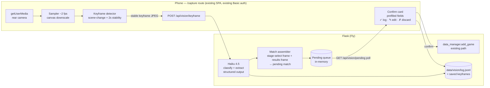

# 010 — Auto-logging V0: hands-free phone capture + VLM extraction

**Stamped against:** commit `65ac301` · **Effort:** L · **Risk of fix:** med
**Executor:** opus (feature plan — larger surface than the 001–009 audit fixes)

## Why

Manual logging is the friction point: every match requires someone to pick up a
phone mid-session and fill the form. The log itself is only five fields
(`shayneCharacter`, `mattCharacter`, `winner`, `stocksRemaining`, `stage`), and
all five are visible on-screen during normal play — characters/winner/stocks on
the results screen, stage on the stage-select screen. A phone propped on the
coffee table pointing at the TV can capture both moments and a vision model can
read them. Humans drop to confirm-only.

## Decisions locked (2026-07-17, Matt)

| Decision | Choice | Rejected alternatives |
|---|---|---|
| Vision engine | **Claude Haiku 4.5 vision** (`claude-haiku-4-5`), server-side, structured output | Local OpenCV templates (weeks of camera-artifact tuning before value); on-device ONNX (roadmap §6 M2 — needs labeled data we don't have yet) |
| Capture UX | **Hands-free from day 1**: propped phone, continuous sampling, client-side keyframe detection auto-fires extraction | One-tap snapshot (simpler, but re-introduces per-match manual action) |
| Pairing | **None** — `/capture` is a route in the existing SPA behind the existing Basic auth | QR pairing tokens + WebSocket rooms (roadmap M0) — deferred to P3 multi-tenancy |
| Storage | **CSV untouched.** Vision provenance (frames, extractions, confirms/corrections) goes to a sidecar JSONL + saved JPEGs | Adding `source`/`confidence` columns to `game_results.csv` — schema change deferred to P2 SQLite |
| Heat maps | **Descoped permanently.** Camera pixels can't recover stage-space coordinates (dynamic camera pan/zoom, parallax); Slippi does it from game memory, unavailable on unmodded Switch | — |
| Damage time series | **Deferred to V1** (local CV). VLM at 1–2 fps is ~$1/match; digit OCR on rectified HUD crops is free. V0's saved frames are V1's training data | — |

Cost basis for the engine choice: ~2 real extraction frames per match plus
screen-classification calls on stable keyframes ≈ **$0.20–0.60 per session**
(Haiku 4.5 input $1/MTok; a 1568px-long-edge frame ≈ 1.6–1.9K tokens).

## Current state (verified excerpts)

`backend/app.py:661` — `add_game` required payload (camelCase, the vision path
must produce exactly this shape):
```python
required_fields = ["shayneCharacter", "mattCharacter", "winner", "stage"]
...
"stocks_remaining": game_data["stocksRemaining"] or None,
```

`backend/app.py:1098–1116` — whole app is behind `@app.before_request` Basic
auth when `SITE_PASSWORD` is set (`hmac.compare_digest`). New endpoints inherit
this for free; the `/capture` page does too.

`backend/Dockerfile:28` — `gunicorn --workers 1 --threads 8 --timeout 60`.
One worker (locked until P2). **No long-lived SSE/WebSocket connections** — a
propped phone holding a stream open would eat 1 of 8 threads for hours. All
transport in this plan is plain request/response; the confirm card lives on the
same phone that captures, so no cross-device push is needed at all.

`frontend/src/App.tsx:109–119` — route table; V0 adds one route. Frontend is
React 18 + Vite + react-router (`BrowserRouter`), Gruvbox/dither design system
per ROADMAP §4–5.

Play data is closed-world: 10 real stages ever logged (Town & City,
Battlefield, Small Battlefield, Yoshi's Story, Pokemon Stadium 2, Final
Destination, Kalos Pokemon League, Smashville, Hollow Bastion, Northern Cave)
and a modest character pool. Canonical stage names live in the frontend stage
picker (`frontend/src/lib/stages.ts`); canonical character names in the
character picker data. Extraction output is normalized against these lists.

`docs/ROADMAP.md` §6 — prior design (QR pairing, events-only uplink, on-device
ONNX M2). This plan supersedes its ordering; §6 is rewritten alongside this
plan to match.

## Architecture



### Keyframe detector (client, ~50 lines, no OpenCV.js)

Gameplay frames change constantly; the frames we need (stage select, results)
are **static screens that follow a scene cut**. So the trigger is: downscale
each sampled frame to a 32×18 luminance grid on a canvas; when the mean
absolute diff vs the previous frame spikes (scene change) and then stays below
a low threshold for ~2 s (stability), emit one keyframe. This filters out all
of gameplay and fires on menus/CSS/stage-select/results — roughly 100–300
events per session, each one Haiku call. Include a duplicate suppressor
(don't re-send a keyframe whose grid is ≈ the last-sent one).

No TV-corner homography calibration in V0 — the VLM reads skewed frames fine.
Ask the user to roughly fill the frame with the TV; show the live preview.

### Extraction call (server)

One Haiku call per keyframe does classification and extraction together, via
structured outputs (`output_config.format`, supported on `claude-haiku-4-5`):

```python
SCHEMA = {  # json_schema, additionalProperties false throughout
  "screen_type": "character_select | stage_select | gameplay | game_splash | results | other",
  "stage": "string|null",              # stage-select/results context
  "left_character": "string|null",     # P1 side as displayed
  "right_character": "string|null",
  "winner_side": "left | right | null",        # results screen banner
  "winner_stocks_remaining": "integer|null",   # visible stock icons, GAME!/results
  "nametags": "array of visible player tags",
  "confidence": "number 0-1"
}
```

Prompt includes the closed-world lists (10 stages verbatim; character pool from
the CSV plus "any other SSBU fighter") and instructs null-over-guess. Output
is normalized against the frontend's canonical stage/character names
(case/spacing-insensitive match; unknown → keep raw string, flag
`needs_review`). Model ID `claude-haiku-4-5`; `ANTHROPIC_API_KEY` from env
(Fly secret); `anthropic` SDK added to `backend/requirements.txt`.

### Match assembler (server, in-memory)

A tiny state machine keyed by capture session:

- `stage_select` frame → remember `pending_stage` (latest wins).
- `results` frame (or `game_splash` followed by `results`) → build a pending
  match: characters + winner + stocks from this frame, stage from
  `pending_stage` (null → confirm card shows the stage picker).
- Winner/character sides map to players via the **port toggle** the capture
  page sends with every keyframe ("Matt is left/P1" — persisted in
  localStorage). Nametag OCR, when present, overrides the toggle.
- Pending matches queue in memory (fine for 1 worker; lost on deploy —
  acceptable, they're seconds-lived). Capture page polls
  `GET /api/vision/pending` every ~3 s and pops a confirm card.

### Endpoints (all inherit Basic auth)

| Endpoint | Purpose |
|---|---|
| `POST /api/vision/keyframe` | multipart JPEG + `{captureSessionId, mattSide}` → classify/extract/assemble; returns `{screen_type}` for client debug HUD |
| `GET /api/vision/pending` | list pending matches `{id, fields…, confidence, frameUrl}` |
| `POST /api/vision/pending/<id>/confirm` | body = possibly-edited fields → `data_manager.add_game(...)` (exact camelCase payload), then remove from queue |
| `POST /api/vision/pending/<id>/discard` | drop |

### Provenance flywheel (V1 training data)

Every keyframe that produced a pending match is saved to
`data/vision/frames/<uuid>.jpg`; every extraction + human confirm/edit/discard
is appended to `data/vision/log.jsonl` (`{ts, frame, extraction, action,
final_fields, match_id}`). Corrections are labeled examples. `DATA_DIR` is the
Fly volume, so this persists. Cap frames dir at ~500 MB (delete oldest).

### Cost guardrails

- Env `VISION_MAX_CALLS_PER_DAY` (default 1500 ≈ a long session ×5 headroom);
  exceeded → keyframes 429, capture page shows "budget hit, log manually".
- Keyframes downscaled client-side to ≤1280px long edge before upload
  (~1.2K tokens/frame).
- Duplicate suppression client-side (above).

## Steps

1. **Backend scaffolding:** `anthropic` in `requirements.txt`; `vision.py`
   module (keep `app.py` from growing: extractor, assembler, queue, JSONL
   logger) wired into `app.py` routes. `ANTHROPIC_API_KEY` read at startup,
   endpoints 503 with a clear message when unset (dev without key still runs).
   Verify: import smoke (`DATA_DIR=/tmp/ssbu-smoke arch -x86_64 ./venv/bin/python -c "import app"`).
2. **Extractor:** Haiku structured-output call + name normalization against
   canonical lists. Unit-test normalization with the Anthropic client mocked.
3. **Assembler + queue + endpoints:** state machine, four routes, JSONL/frame
   persistence, daily budget counter. Unit-test the state machine end-to-end
   with mocked extractions (stage-then-results, results-without-stage,
   duplicate results frames, side-mapping both ways).
4. **Capture page:** `/capture` route + `CapturePage.tsx` (getUserMedia rear
   camera, sampler, keyframe detector, uploader, port toggle, pending poll,
   confirm card reusing the existing log-form field components, debug HUD
   showing last classification). Match the interior-page reskin language.
5. **Wake lock + lifecycle:** `navigator.wakeLock` (screen must stay on),
   pause sampling when tab hidden, camera permission error states.
6. **Live fire:** deploy with the Fly secret, run a real session, tune the two
   detector thresholds (scene-change spike, stability window) from the debug
   HUD, and record actual per-session cost from the JSONL call count.
7. **Docs commit** (required by workflow): ROADMAP §6/§3/§7 sync (done with
   this plan), README feature blurb, `docs/DEPLOY.md` secret addition.

## Test plan

- **Unit (backend, mocked Anthropic):** normalization table; assembler
  transitions incl. missing-stage and dup-frame; budget cap; confirm →
  `add_game` payload shape asserted field-for-field against
  `app.py:661`'s contract; JSONL rows written on every action.
- **Contract:** confirm endpoint with edited fields produces a CSV row
  identical to one from the manual form (use existing test fixtures).
- **Manual/live:** step 6 is the real test — a session where every match gets
  a confirm card, zero manual form entries. Acceptance: ≥90% of matches
  produce a card with all five fields correct pre-edit; misses are correctable
  on the card.

## Done criteria

- [ ] A real session logged end-to-end from the propped phone: confirm-taps only, no manual form use
- [ ] `backend` pytest green incl. new vision tests; ruff/black clean; frontend tsc/eslint/build green
- [ ] `game_results.csv` schema unchanged (9 columns); all vision metadata in `data/vision/`
- [ ] Per-session VLM cost measured and recorded in the JSONL summary (< $1/session expected)
- [ ] No new long-lived connections (verify: no SSE/WebSocket, polling only)

## Out of scope — do not touch

- Damage-over-time series and stock-event timelines (V1, local CV — the frames
  this plan saves are its dataset)
- Spatial damage heat maps (permanently descoped — see Decisions)
- QR pairing / cross-device confirm / multi-tenant capture (P3)
- CSV schema changes, SQLite (P2)
- On-device models, OpenCV.js, homography calibration UI
- Auto-submit without human confirm (revisit only after measured precision
  from the JSONL justifies it — roadmap M3's 10-s-undo idea)

## Escape hatches

- If the stability-gated detector misses results screens in live fire (e.g.
  animated results background defeats the stability check), fall back to a
  cheap interval mode: one classification frame every 5 s while a match is
  believed in progress — costs ~3× but unblocks; tune later.
- If Haiku extraction accuracy on skewed camera frames is < ~80% per field in
  step 6, retry the same frame once at full resolution before surfacing a
  low-confidence card; if still poor, escalate model per-frame
  (`claude-sonnet-5`) behind an env flag rather than redesigning.
- If `getUserMedia` in iOS Safari fights the wake lock or drops the camera on
  tab blur, ship step 4 with a "keep screen on" instruction banner and accept
  it; don't burn time on a native wrapper.
- Anthropic API outage mid-session → keyframes queue client-side up to 20
  frames, then the page tells the user to log manually; never lose a match
  silently.
